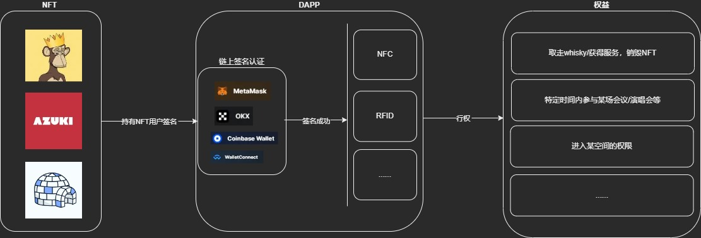
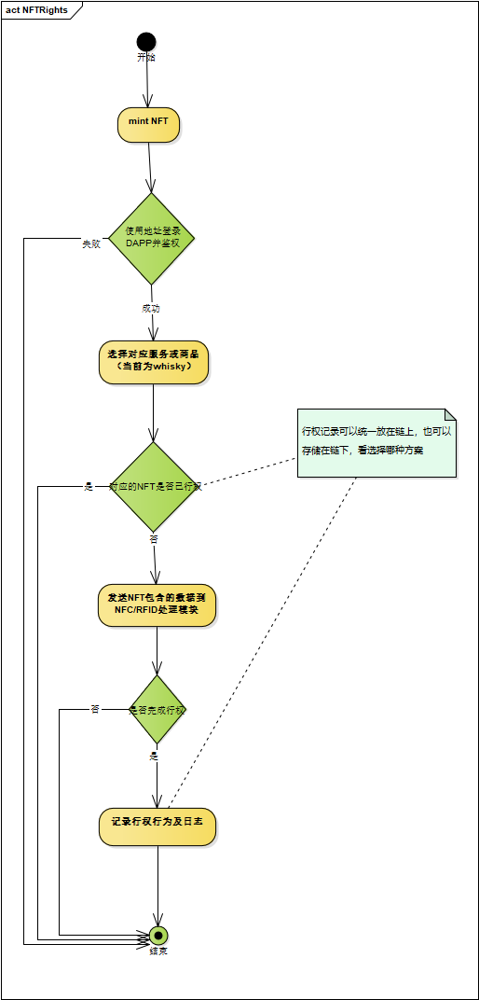

# NFT off-chain Rights
此构想是创建一个能够实现，链上NFT的权益在链下行权的一个平台。当一个商户或组织，在web3上发行了一套NFT，代表了一组权益，可能是某种商品或服务的兑换券，也可能是某场会议的参与凭证等，通过我们这个平台的dapp，实现这种权益的链下行权。

## 示意图

## 主要技术点
1. 链上NFT
2. 链上数据获取
3. 钱包签名
4. NFC/RFID执行链下业务逻辑

## 业务流程图
此平台需要业务支撑，目前暂做简化版本，使用whisky做为业务依托，简单的业务逻辑，以下是用户角度的业务流程图。

whisky如果领取，或开封后，会有状态回传，会用到chainlink的一些特性
